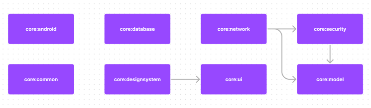

### 🚧 Suwiki는 현재 리팩토링 작업 중입니다.

# Suwiki

# Introduce

**Suwiki(수위키)** 는 수원대학교 재학생들의 불편함을 해결하기 위해 만들어진 시간표 & 강의평가 서비스입니다. 대략 **43**개의 모듈로 이루어져 있으며 Clean Architecture, Mvi, Hilt, Coroutine, Flow, Jetpack
Compose 등의 기술이 적용되어 있습니다.

2023년 12월 13일 기준 **2039**명의 유저가 사용 중입니다.

# Architecture

Suwiki는 Mvi 기반의 Clean Architecture 구조로 설계되어 있으며 크게 core, data, domain, feature 모듈로 구성되어 있습니다.
presentation layer에서는 UDF(단방향 데이터 흐름) 패턴을 사용합니다.

> 유지 보수를 해가며 모듈이 과하게 나누어져 있다면 통합을, 추가로 나눠야한다면 분리할 생각입니다. Suwiki Architecture는 계속 변경될 예정이며 피드백이나 질문이 있다면 koownij@kakao.com으로 언제든지 연락 주세요 :)

## Module

### 40개가 넘는 모듈로 나눈 이유

#### 1. Suwiki는 최소 5년 이상의 서비스를 목표로 하고 있습니다.

오랜 시간이 지난 후 코드를 다시 보았을 때, 관심사별로 모듈이 분리되어 있다면 유지 보수가 쉬울거라 판단했기 때문입니다.

#### 2. 인원이 계속 변경됩니다.

고정된 인원이 개발을 하는 것이 아니며 수원대학교 후배들에게 프로젝트를 넘겨주며 이어나갈 생각입니다. 모듈 분리가 명확하다면 새로운 인원이 코드를 변경해도 안전하기 때문입니다.

#### 3. 새로운 Feature가 추가될 가능성이 큽니다.

새로운 기능이 추가되더라도 모듈 분리가 되어있기 때문에 기존 코드에 영향을 주기 어렵습니다.

#### 4. 멀티 모듈 단점 극복

40개의 모듈로 분리했기 때문에 오히려 복잡해보일 수 있습니다. 하지만 문서화를 통해 모듈간의 의존성과 모듈이 어떤 역할을 하는지 자세히 적어놓는다면 해결할 수 있다 생각했습니다.

### 모듈화 기준

#### 1. Clean Architecture의 Layer와 앱의 Feature 단위로 분리

ex) 시간표, 강의평가

`domain:timetable`, `data:timetable`, `feature:timetable`
`domain:lectureevaluation`, `data:lectureevaluation`, `feature:lectureevaluatioin`

#### 2. 모듈의 특정 부분이 여러 곳에서 사용된다면 분리

ex) 강의평가 Create/Read/Update/Delete 기능 중 Create/Update/Delete 부분이 `feature:myinfo`, `feature:lectureevaluation`에서 사용되는 경우

강의평가 Read 기능과 Create/Update/Delete 기능을 분리합니다. -> `feature:lectureevaluation:viewer`, `feature:lectureevaluation:editor`

### 모듈 설명

feature, data, domain, local, remote 모듈이 가지는 의존성은 아래와 같습니다. (core 모듈 등 일부 모듈의 의존성은 사진에서 제외함)

#### core

이름에서 유추할 수 있듯 많은 모듈에서 재사용하는 핵심 코드입니다. core 모듈간의 의존성은 가질 수 있으나 core 모듈이 다른 모듈(feature, data, domain, local, remote)의 의존성을 가지면 안됩니다.

|        이름         |                          역할                           |
|:-----------------:|:-----------------------------------------------------:|
|   core:android    |     안드로이드 의존성을 가지는 모듈들이 공통적으로 사용할 수 있는 코드가 존재합니다.     |
|    core:common    |           모든 모듈에서 공통적으로 사용할 수 있는 코드가 존재합니다.           |
|   core:database   |       Local Database(Room), Jetpack - DataStore       |
| core:designsystem |          Component, Theme, Color, Typography          |
|   core:network    |                Retrofit2 관련 코드가 존재합니다.                |
|      core:ui      | ui에서 공통으로 사용하는 코드가 존재합니다. 예를 들면 Modifier의 확장함수가 있습니다. |
|   core:security   |           특정 값을 암호화해주는 모듈입니다. Jwt를 암호화합니다.            |
|    core:model     |             공통적으로 사용하는 Model이 정의되어 있습니다.              |

#### feature

모든 feature 모듈은 `feature:navigation` 모듈에 의존하고 있습니다.

#### 그 외

|         이름          |                    역할                    |
|:-------------------:|:----------------------------------------:|
|         app         |                레거시 코드입니다.                |
|     app:compose     |            새롭게 리팩토링 중인 모듈입니다.            |
| data, local, remote |     Clean Architecture에서의 data Layer     |
|       domain        |    Clean Architecture에서의 domain Layer    |
|       feature       | Clean Architecture에서의 presentation Layer |
